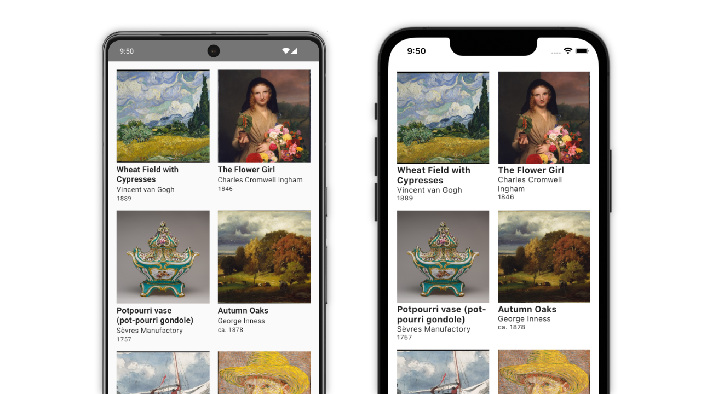

# Cosmic Meta News - Kotlin Multiplatform App



A modern, clean **Kotlin Multiplatform** news application that fetches real-time news from the Cosmic Meta RSS feed. Built with **Compose Multiplatform** for shared UI across Android and iOS platforms.

## 📱 Features

### News Reading
- 📰 **Real-time RSS Feed** - Fetches latest news from `https://api.cosmicmeta.ai/rss`
- 🔄 **Pull-to-Refresh** - Easy content refresh with native pull gesture
- 🖼️ **Image Support** - Cached image loading for better performance
- 📖 **Full Article View** - Detailed article screen with external link opening
- ⏰ **Smart Date Formatting** - Relative time display ("2h ago", "3d ago")

### Settings & Notifications
- 🔔 **Smart Notifications** - Category-based notification system
- 🏷️ **Category Filtering** - Choose from multiple categories:
  - Technology, Science, Business, Health, Entertainment, Sports, Politics
- ⏱️ **Flexible Frequency** - Multiple notification intervals:
  - Real-time, Every 15 minutes, Hourly, Twice daily, Daily
- ⚙️ **Easy Configuration** - Simple, intuitive settings interface

### User Experience
- 🎨 **Material 3 Design** - Modern, clean interface following Material Design guidelines
- 📱 **Responsive Layout** - Optimized for various screen sizes
- ⚡ **Performance Optimized** - Efficient image caching and smooth scrolling
- 🌐 **Cross-Platform** - Shared UI and business logic for Android and iOS

## 🛠️ Technical Stack

### Kotlin Multiplatform
- **Shared Business Logic** - Common code for news fetching, data models, and ViewModels
- **Platform-Specific Implementation** - Native performance where needed
- **Type-Safe** - Full Kotlin type safety across platforms

### UI & Design
- **Compose Multiplatform** - Shared UI with native performance
- **Material 3** - Latest Material Design components
- **Navigation Compose** - Type-safe navigation between screens
- **Coil** - Advanced image loading with caching

### Networking & Data
- **Ktor** - Multiplatform HTTP client for RSS fetching
- **kotlinx.serialization** - Type-safe JSON/XML serialization
- **kotlinx.datetime** - Cross-platform date/time handling
- **Koin** - Lightweight dependency injection

## 📁 Project Structure

```
composeApp/src/
├── commonMain/kotlin/com/cosmicmeta/news/
│   ├── data/
│   │   ├── NewsItem.kt           # News data models
│   │   ├── RssFeed.kt            # RSS parsing models
│   │   └── SettingsData.kt       # Notification settings
│   ├── network/
│   │   └── NewsApi.kt            # RSS API client
│   ├── repository/
│   │   └── NewsRepository.kt     # Data repository layer
│   ├── ui/
│   │   ├── components/
│   │   │   └── NewsCard.kt       # Reusable UI components
│   │   ├── screens/
│   │   │   ├── NewsListScreen.kt # Main news feed
│   │   │   ├── NewsDetailScreen.kt # Article details
│   │   │   └── SettingsScreen.kt # Notification settings
│   │   └── viewmodel/
│   │       ├── NewsListViewModel.kt
│   │       └── SettingsViewModel.kt
│   ├── di/
│   │   └── AppModule.kt          # Dependency injection
│   └── App.kt                    # Main app entry point
├── androidMain/kotlin/com/cosmicmeta/news/
│   └── MainActivity.kt           # Android app entry
└── iosMain/kotlin/com/cosmicmeta/news/
    └── MainViewController.kt     # iOS app entry
```

## 🚀 Getting Started

### Prerequisites
- **Android Studio** Iguana or later
- **Xcode** 15+ (for iOS development)
- **JDK** 11 or later
- **Kotlin** 2.0+

### Setup Instructions

1. **Clone the repository**
   ```bash
   git clone https://github.com/your-username/cosmic-meta-news-app.git
   cd cosmic-meta-news-app
   ```

2. **Open in Android Studio**
   - File → Open → Select the project directory
   - Wait for Gradle sync to complete

3. **Run on Android**
   ```bash
   ./gradlew composeApp:assembleDebug
   ./gradlew composeApp:installDebug
   ```

4. **Run on iOS** (macOS only)
   ```bash
   cd iosApp
   xcodebuild -scheme iosApp -destination 'platform=iOS Simulator,name=iPhone 15' build
   ```

### Development Commands

```bash
# Clean build
./gradlew clean

# Build for all platforms
./gradlew build

# Run Android app
./gradlew composeApp:installDebug

# Run tests
./gradlew test
```

## 🏗️ Architecture

### MVVM Pattern
- **ViewModels** - Handle business logic and state management
- **Repositories** - Abstract data access layer
- **API Services** - Handle network communication
- **Compose UI** - Reactive UI that responds to state changes

### Data Flow
1. **RSS Feed** → **Ktor Client** → **Repository** → **ViewModel** → **Compose UI**
2. **Settings** → **Local Storage** → **ViewModel** → **Notification System**

### Key Components
- **NewsApi** - Fetches and parses RSS feed from Cosmic Meta
- **NewsRepository** - Caches news data and manages refresh logic
- **ViewModels** - Provide UI state and handle user interactions
- **Compose Screens** - Reactive UI components

## 🔧 Configuration

### RSS Feed Source
The app fetches news from: `https://api.cosmicmeta.ai/rss`

### Notification Categories
- Technology
- Science
- Business
- Health
- Entertainment
- Sports
- Politics

### Notification Frequencies
- Real-time (immediate)
- Every 15 minutes
- Hourly
- Twice daily
- Daily

## 🎨 Design Philosophy

### Simple & Clean
- **Minimalist Interface** - Focus on content, not clutter
- **Intuitive Navigation** - Easy-to-understand user flows
- **Performance First** - Smooth animations and quick loading

### Accessibility
- **Material 3 Standards** - Follows accessibility guidelines
- **High Contrast** - Readable text and clear visual hierarchy
- **Touch Targets** - Appropriate sizing for all interactions

## 🧪 Testing

```bash
# Run unit tests
./gradlew testDebugUnitTest

# Run instrumented tests (Android)
./gradlew connectedDebugAndroidTest

# Run all tests
./gradlew check
```

## 📦 Dependencies

### Core
- `kotlin-multiplatform` - Cross-platform development
- `compose-multiplatform` - Shared UI framework
- `ktor` - Networking client
- `kotlinx-serialization` - Data serialization
- `koin` - Dependency injection

### UI & UX
- `material3` - Material Design components
- `navigation-compose` - Screen navigation
- `coil` - Image loading and caching
- `androidx-lifecycle` - Lifecycle management

## 🚧 Future Enhancements

- [ ] **Search Functionality** - Search within news articles
- [ ] **Bookmarks** - Save articles for later reading
- [ ] **Dark Theme** - Toggle between light and dark modes
- [ ] **Offline Reading** - Cache articles for offline access
- [ ] **Social Sharing** - Share articles to social media
- [ ] **Push Notifications** - Real-time notification delivery
- [ ] **Categories Filter** - Filter news by specific categories
- [ ] **Reading Progress** - Track reading history

## 📄 License

This project is licensed under the Apache License 2.0 - see the [LICENSE](LICENSE) file for details.

## 🤝 Contributing

1. Fork the repository
2. Create your feature branch (`git checkout -b feature/amazing-feature`)
3. Commit your changes (`git commit -m 'Add some amazing feature'`)
4. Push to the branch (`git push origin feature/amazing-feature`)
5. Open a Pull Request

## 📧 Contact

- **Author**: Your Name
- **Email**: your.email@example.com
- **Project Link**: [https://github.com/your-username/cosmic-meta-news-app](https://github.com/your-username/cosmic-meta-news-app)

---

**Built with ❤️ using Kotlin Multiplatform and Compose Multiplatform**